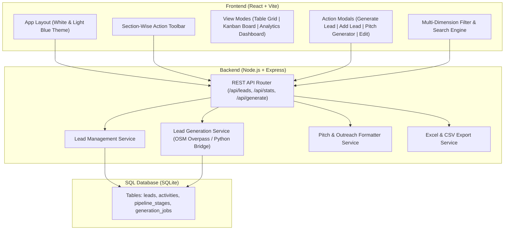

# 📋 Collabsight AV CRM Web Application Plan (`crm-web`)

## 1. Project Overview & Objectives

**Collabsight Technologies Pvt Ltd** needs a dedicated, modern, responsive web-based CRM to **manage**, **generate**, **view**, and **filter** SMB customer leads across the Mumbai Metropolitan Region (Kalyan, Thane, Navi Mumbai, Andheri, BKC) and Tier-2/Tier-3 commercial hubs (Pune, Nashik, Aurangabad, Nagpur, Surat).

### Core Goals:
1. **Interactive & Responsive UI**: Clean, light, high-performance web experience on desktop, tablet, and mobile.
2. **White & Light Blue Theme**: Professional, modern aesthetic with soft sky-blue gradients, glass cards, crisp typography, and high contrast for readability.
3. **Section-Wise Action Buttons**: Clear visual grouping for each major workflow (Lead Generation, Ingestion, Filtering, Batch Operations, Outreach & Pitches, View Switching).
4. **Modern Tech Stack**: React frontend, Node.js (Express) backend, and a robust SQL database (SQLite with transactional integrity and relational schema).

---

## 2. System Architecture



---

## 3. Tech Stack Specification

| Layer | Technology | Details |
| :--- | :--- | :--- |
| **Frontend** | **React 18+ (Vite)** | Ultra-fast HMR build, modular component design, responsive layouts. |
| **Styling** | **Tailwind CSS + Custom Light Blue Palette** | Modern glassmorphism, soft cyan/sky blue accents, animated transitions. |
| **Icons & UI** | **Lucide React** | Clean, minimalist icon set for all section actions and buttons. |
| **Backend** | **Node.js (Express)** | Lightweight, async RESTful API, structured route controllers, CORS enabled. |
| **Database** | **SQL (SQLite via `better-sqlite3` / `sqlite3`)** | Zero-configuration, ACID-compliant local SQL engine with indexed queries and raw SQL migrations. |
| **Data Ingestion** | **Python Script Bridge / OSM API** | Direct integration with our existing lead scraper and 45 curated AV accounts. |

---

## 4. UI/UX Design System: White & Light Blue Theme

### Color Palette:
* **Background Canvas:** Pure White (`#FFFFFF`) to Ice Blue tint (`#F8FAFC` / `#F0F9FF`)
* **Primary Brand Blue:** Sky / Ocean Blue (`#0284C7` / `#0EA5E9`)
* **Surface & Card Background:** Soft Frost Blue (`#F0F7FF`) with subtle border (`#BAE6FD`)
* **Hover & Interactive Highlights:** Electric Azure (`#38BDF8`) & Deep Sky Blue (`#0369A1`)
* **Typography:** Deep Slate Navy (`#0F172A`) for headings, Muted Charcoal (`#475569`) for body text
* **Status Badges:**
  * **Hot / Urgent:** Coral Red badge (`#FEE2E2` text `#DC2626`)
  * **Warm / Active:** Amber Gold badge (`#FEF3C7` text `#D97706`)
  * **Won / Success:** Emerald Green badge (`#DCFCE7` text `#16A34A`)
  * **New / Uncontacted:** Light Blue badge (`#E0F2FE` text `#0369A1`)

### Component Design:
* Rounded corners (`rounded-xl` and `rounded-2xl`)
* Soft layered shadows (`shadow-sm hover:shadow-md transition-all`)
* Sectional button clusters with distinct visual icon tags and responsive tooltips.

---

## 5. Section-Wise Major Action Buttons

The interface will feature a structured, section-based action bar so users can trigger major actions effortlessly:

```
┌────────────────────────────────────────────────────────────────────────────────────────┐
│ SECTION 1: LEAD GENERATION & INGESTION                                                 │
│ [ ⚡ Fetch Live OSM Leads ]  [ 🤖 Generate Curated Leads ]  [ ➕ Add Single Lead ]  [ 📥 Import CSV ]│
├────────────────────────────────────────────────────────────────────────────────────────┤
│ SECTION 2: VIEW & WORKSPACE MODES                                                      │
│ [ 📊 Table Data Grid ]  [ 📋 Kanban Pipeline Board ]  [ 📈 Executive Analytics ]       │
├────────────────────────────────────────────────────────────────────────────────────────┤
│ SECTION 3: SMART FILTER PRESETS                                                        │
│ [ All Verticals ▼ ] [ Region: MMR / Pune / Tier 2-3 ▼ ] [ Priority: Hot/Warm ▼ ] [ Stage ▼ ]│
├────────────────────────────────────────────────────────────────────────────────────────┤
│ SECTION 4: BATCH & BULK OPERATIONS (Appears when leads are selected)                  │
│ [ 🔄 Update Stage ]  [ ✉️ Generate Batch Emails ]  [ 📤 Export Excel ]  [ 🗑️ Delete Selected ] │
├────────────────────────────────────────────────────────────────────────────────────────┤
│ SECTION 5: OUTREACH & QUICK ACTION (Per Lead / Contextual)                             │
│ [ 📧 1-Click Cold Email ]  [ 💬 Direct WhatsApp Link ]  [ 📞 60s Call Script Modal ]     │
└────────────────────────────────────────────────────────────────────────────────────────┘
```

---

## 6. SQL Database Schema

```sql
-- 1. Leads Table (Core B2B AV Data)
CREATE TABLE IF NOT EXISTS leads (
    id TEXT PRIMARY KEY,
    company_name TEXT NOT NULL,
    vertical TEXT NOT NULL,          -- corporate_it, architects_interior, education_coaching, hospitality_coworking
    city TEXT NOT NULL,
    sub_region TEXT,
    address TEXT,
    phone TEXT,
    website TEXT,
    target_role TEXT,
    suggested_contact_name TEXT,
    primary_av_need TEXT,
    pitch_angle TEXT,
    budget_tier TEXT,
    priority TEXT DEFAULT 'Warm',    -- Hot, Warm, Cold
    status TEXT DEFAULT 'New',       -- New, Contacted, Meeting Fixed, Proposal Sent, Won, Lost
    deal_value REAL DEFAULT 0,       -- Estimated deal in INR (Lakhs)
    notes TEXT,
    created_at DATETIME DEFAULT CURRENT_TIMESTAMP,
    updated_at DATETIME DEFAULT CURRENT_TIMESTAMP
);

-- 2. Activity / Interaction History Table
CREATE TABLE IF NOT EXISTS activities (
    id INTEGER PRIMARY KEY AUTOINCREMENT,
    lead_id TEXT NOT NULL,
    action_type TEXT NOT NULL,       -- Email, WhatsApp, Call, Meeting, Note
    summary TEXT NOT NULL,
    outcome TEXT,
    created_at DATETIME DEFAULT CURRENT_TIMESTAMP,
    FOREIGN KEY(lead_id) REFERENCES leads(id) ON DELETE CASCADE
);

-- 3. Lead Generation Jobs Log
CREATE TABLE IF NOT EXISTS generation_jobs (
    id INTEGER PRIMARY KEY AUTOINCREMENT,
    source TEXT NOT NULL,            -- OSM_Overpass, Curated_Seed, Manual_Import
    region TEXT,
    vertical TEXT,
    leads_added INTEGER DEFAULT 0,
    created_at DATETIME DEFAULT CURRENT_TIMESTAMP
);

CREATE INDEX IF NOT EXISTS idx_leads_city ON leads(city);
CREATE INDEX IF NOT EXISTS idx_leads_vertical ON leads(vertical);
CREATE INDEX IF NOT EXISTS idx_leads_priority ON leads(priority);
CREATE INDEX IF NOT EXISTS idx_leads_status ON leads(status);
```

---

## 7. REST API Endpoints Design (`/api`)

| Method | Endpoint | Description |
| :--- | :--- | :--- |
| `GET` | `/api/leads` | Get leads with dynamic search, multi-field filtering, sorting & pagination |
| `GET` | `/api/leads/:id` | Get full single lead details with historical activity log |
| `POST` | `/api/leads` | Create a new lead record |
| `PUT` | `/api/leads/:id` | Update lead fields, status, priority, or notes |
| `DELETE` | `/api/leads/:id` | Delete a single lead |
| `POST` | `/api/leads/batch-delete` | Bulk delete selected leads |
| `POST` | `/api/leads/batch-status` | Bulk update lead status (e.g. move to "Contacted") |
| `POST` | `/api/leads/generate` | Trigger live generation (OSM or Curated seed ingestion) |
| `GET` | `/api/leads/:id/pitch` | Generate personalized Cold Email, WhatsApp, and Phone calling scripts |
| `POST` | `/api/leads/:id/activity`| Log a call, email, or meeting note for a lead |
| `GET` | `/api/stats` | Pipeline metrics (Total Leads, Pipeline Value, Conversion Rates, By Vertical & City) |
| `GET` | `/api/export/excel` | Download formatted multi-tab `.xlsx` workbook |
| `GET` | `/api/export/csv` | Download standard CRM `.csv` |

---

## 8. Step-by-Step Implementation Roadmap

1. **Step 1: Environment & Directory Initialization (`crm-web`)**
   * Set up Node.js runtime and project workspaces:
     * `crm-web/server` (Express backend, SQL database manager, seed scripts, REST API routes).
     * `crm-web/client` (React + Vite + Tailwind CSS frontend).
2. **Step 2: SQL Database Setup & Seeding**
   * Initialize `crm.sqlite` with tables and indexes.
   * Write migration script to auto-seed the 45 curated AV leads from our existing data so the CRM is immediately loaded with real leads upon initial boot.
3. **Step 3: Backend API & Lead Generator Bridge**
   * Implement Express controllers for CRUD, search/filtering, stats, and Excel/CSV export.
   * Implement `/api/leads/generate` endpoint connecting to OSM Overpass and Curated lead generation routines.
   * Implement `/api/leads/:id/pitch` endpoint reusing Collabsight's high-conversion outreach engine.
4. **Step 4: Frontend Design & UI Components**
   * Implement White & Light Blue theme with Tailwind CSS.
   * Build Top Header (Company branding, pipeline stats summary).
   * Build **Section-Wise Action Toolbar** with grouped buttons.
5. **Step 5: View Implementations**
   * **Table Grid View:** Sortable columns, inline status dropdowns, priority badges, action menu.
   * **Kanban Board View:** Drag/click cards organized by pipeline stages (New ➔ Contacted ➔ Meeting Fixed ➔ Proposal Sent ➔ Won).
   * **Analytics View:** KPI cards, deal size distributions, vertical breakdown charts.
6. **Step 6: Modals & Workflows**
   * **Lead Generation Modal:** Pick region (Kalyan, Thane, Navi Mumbai, Pune, etc.) and vertical to fetch leads.
   * **Lead Detail & Pitch Modal:** View lead notes, 1-click copy for tailored cold email, direct WhatsApp web button, and 60-second call rebuttal script.
   * **Add / Edit Lead Modal:** Form validation with AV requirement presets.
7. **Step 7: Verification & Launch**
   * Run end-to-end tests for filtering, generating, updating, exporting, and responsive UI scaling.
   * Provide user instructions to start the dev server or production preview with a single command.
